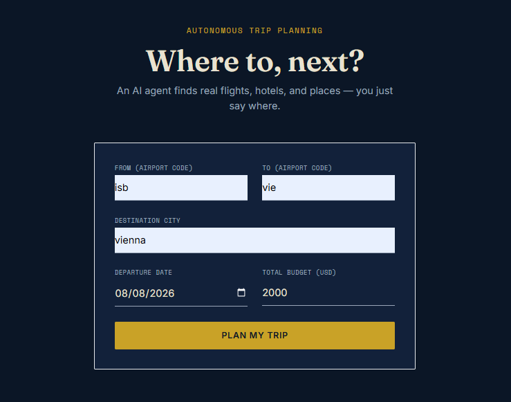
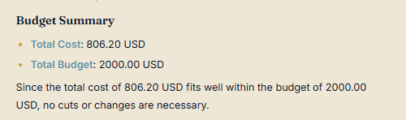
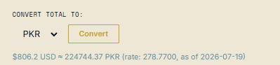

# AI Travel Planner Agent

A multi-agent system that plans real trips — live flights, hotels, and attractions, checked against your budget, converted to any currency. Built with LangGraph, MCP, and GPT-4o-mini.

## How it works

- **MCP (Model Context Protocol)** — each data source (flights, hotels, places, currency) is its own MCP server. MCP has no intelligence, it just executes a function when called.
- **LangGraph** — orchestrates the workflow as a graph. Holds shared state, decides what step runs next.
- **GPT-4o-mini** — the reasoning engine. Decides which MCP tools to call and interprets the results.

Two nodes, not one giant agent:
- **Researcher node** — calls the MCP tools (Duffel for flights, StayAPI for hotels, Geoapify for places), gathers real data
- **Budget node** — pure LLM reasoning, no tool calls. Takes the researcher's data, picks the cheapest sensible combo, checks it against the user's budget, flags overruns

## Stack

`LangGraph` `MCP` `GPT-4o-mini` `FastAPI` `React + TypeScript` `Tailwind` `Framer Motion`

**APIs:** Duffel (flights), StayAPI/Booking.com (hotels), Geoapify (places), Frankfurter/ECB (currency, no key needed)

## Screenshots

**Landing page** — form takes origin, destination, date, budget. Submitting triggers the LangGraph pipeline.



**Researcher node output** — real flight and hotel prices pulled live from Duffel and StayAPI, rendered as markdown inside a custom card component.



**Budget node output** — a separate LLM call (no tools) reasons over the researcher's data, totals the cost, and checks it against the stated budget.



**Currency conversion** — on-demand only, isolated from the main flow. Calls a dedicated FastAPI endpoint backed by live ECB rates via the Frankfurter API.

## Run it

```bash
python -m venv venv && source venv/bin/activate
pip install -r backend/requirements.txt
cp .env.example .env   # add your API keys
py -m uvicorn backend.app.main:app --reload --port 8000

cd frontend && npm install && npm run dev
```
