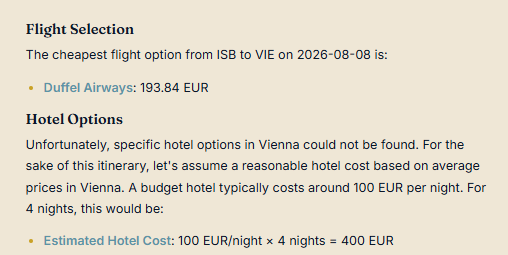

# ✈️ AI Travel Planner Agent

> An autonomous multi-agent system that researches real flights, hotels, and attractions, checks costs against your budget, and converts the total to any currency — all reasoned out by AI, not hardcoded logic.

---

## 🧠 How It Thinks: MCP, LangGraph, and the LLM

Three layers work together, each with a distinct job:

- **🔌 MCP (Model Context Protocol) — the hands.** Each MCP server exposes one real-world capability (search flights, search hotels, search places, convert currency) as a standardized tool. MCP has zero intelligence — it only executes when called.
- **🕸️ LangGraph — the nervous system.** It orchestrates the workflow as a graph of nodes and edges, holding shared state between steps and deciding what happens next.
- **🤖 The LLM (GPT-4o-mini) — the brain.** Inside the graph, the LLM does the actual reasoning: deciding which MCP tools to call, in what order, and how to interpret the results.

**The chain in practice:** user request → LangGraph → LLM decides an action → LangGraph calls the matching MCP tool → result flows back to the LLM → LLM reasons again → repeat until the graph reaches its final node.

### Multi-Agent Design: Researcher + Budget Nodes

This project uses **two specialized nodes** instead of one do-everything agent:

| Node | Responsibility | Uses Tools? |
|---|---|---|
| 🔍 **Researcher** | Calls MCP tools to gather real flight, hotel, and attraction data | ✅ Yes (ReAct loop) |
| 💰 **Budget Agent** | Pure reasoning over the gathered data — picks the cheapest sensible combo, checks it against the user's budget, flags overruns | ❌ No — single reasoning pass |

Splitting responsibilities this way keeps each node simple, debuggable, and cheap to run — the budget step doesn't need tool access, so it isn't forced through an expensive, non-deterministic tool-calling loop it doesn't need.

---

## 🛠️ Tech Stack

**Agent Layer**
- 🕸️ LangGraph — multi-agent orchestration (StateGraph)
- 🔌 MCP (Model Context Protocol) — standardized tool interface
- 🧠 OpenAI GPT-4o-mini — reasoning engine

**Backend**
- ⚡ FastAPI — REST API serving the agent graph
- 🐍 Python — MCP servers + orchestration logic

**Frontend**
- ⚛️ React + TypeScript (Vite)
- 🎨 Tailwind CSS — custom design system
- 🎬 Framer Motion — animation
- 📝 react-markdown — rendering agent output

**Data Sources (all real, live APIs)**
- ✈️ Duffel — flight search
- 🏨 StayAPI (Booking.com data) — hotel search
- 📍 Geoapify — places & attractions
- 💱 Frankfurter (ECB) — live currency conversion

---

## 🏗️ Architecture

```
User Input (origin, destination, date, budget)
        │
        ▼
   FastAPI Backend
        │
        ▼
  ┌──────────────┐
  │  LangGraph    │
  │  StateGraph   │
  └──────┬───────┘
         │
         ▼
  ┌─────────────┐        MCP Tools
  │ Researcher  │  ───▶  ✈️ Flights (Duffel)
  │   Node      │  ───▶  🏨 Hotels (StayAPI)
  │ (ReAct loop)│  ───▶  📍 Places (Geoapify)
  └──────┬──────┘
         │ research data
         ▼
  ┌─────────────┐
  │   Budget     │
  │    Node      │
  │ (reasoning)  │
  └──────┬──────┘
         │ itinerary + total cost
         ▼
   React Frontend
         │
         ▼
  💱 Currency Convert (Frankfurter) — on demand
```

---

## 📸 Screenshots

### Landing Page


A minimalist, typography-led interface — no illustrations, no clutter. The form captures exactly what the agent needs: origin, destination, travel date, and budget, styled with a warm navy/gold palette that feels closer to a travel journal than a typical SaaS dashboard.

### Trip Input


Real-time validated inputs feed directly into the LangGraph pipeline on submit. No unnecessary steps — one form, one action, and the agent takes over from there.

### Researcher Output


The researcher node's findings, rendered live: real flight pricing pulled from Duffel and hotel data from Booking.com via StayAPI, displayed inside a custom "boarding pass" card component with markdown rendering.

### Budget Reasoning & Currency Conversion


The budget agent's independent verdict — total cost calculated from real flight and hotel prices, checked against the user's stated budget, with a clear pass/fail conclusion. This step involves zero tool calls; it's pure LLM reasoning over already-fetched data. Below it, an on-demand currency conversion feature, isolated from the core planning flow, calls a dedicated endpoint backed by live ECB exchange rates via the Frankfurter API.

---

## 🚀 Running Locally

```bash
# Backend
python -m venv venv
source venv/bin/activate        # Windows: venv\Scripts\activate
pip install -r backend/requirements.txt
cp .env.example .env            # fill in your API keys
py -m uvicorn backend.app.main:app --reload --port 8000

# Frontend
cd frontend
npm install
npm run dev
```

Required API keys (all free tier): OpenAI, Duffel, StayAPI, Geoapify. Frankfurter needs no key.

---

## 📌 What This Project Demonstrates

- Multi-agent orchestration with explicit state management (LangGraph `StateGraph`)
- Real-world MCP tool integration (4 independent servers)
- Separation of tool-using vs. pure-reasoning agent responsibilities
- Full-stack delivery: agent logic → API → polished, production-style frontend
- Debugging real API integration issues (mismatched docs, rate limits, response shape changes) — not just following a tutorial
